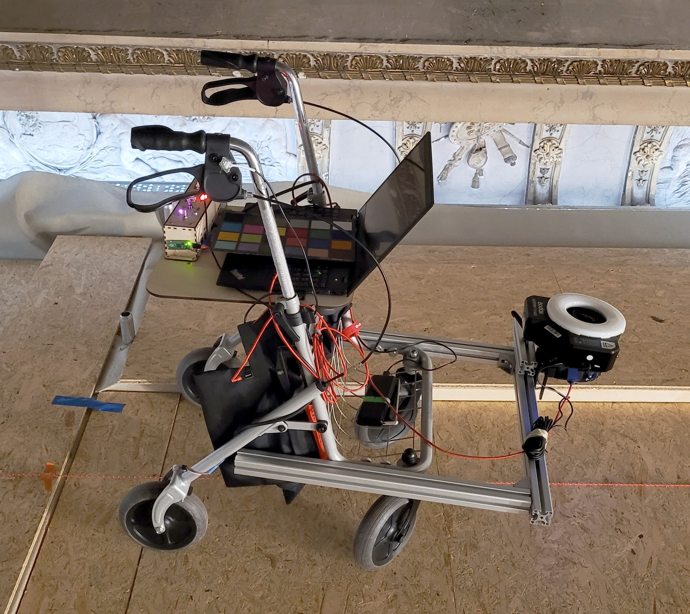
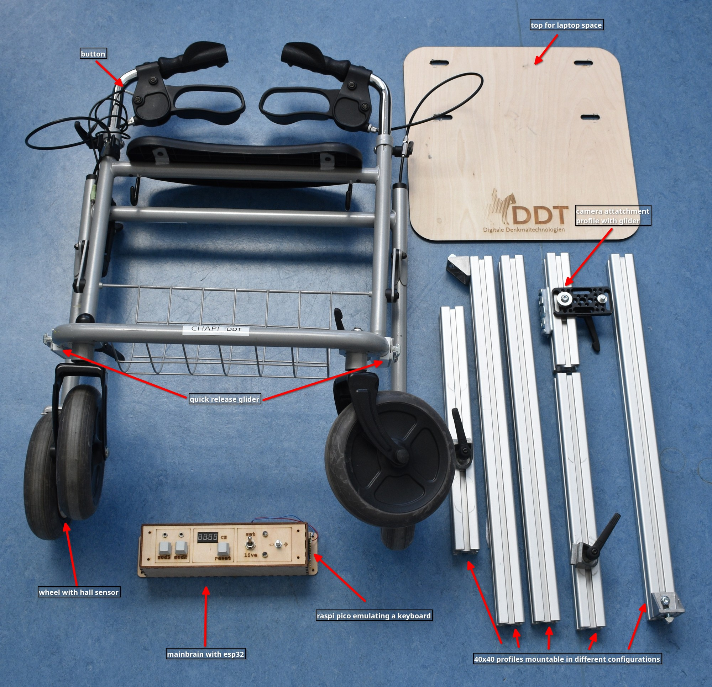

 
# CHAPI

Meet CHAPI (Cultural Heritage Automated Photogrammetric Imager), a low cost solution which provides a method for capturing large ceiling paintings in high detail, with a consistent photogrammetric network in limited time.

# Goals

-  a stable, mobile platform on which a camera could be mounted in multiple orientations
-  a method of automatically measuring distance with a resolution sufficient for a dense photogrammetric network
-  a method of automatically triggering a camera tethered to a laptop
-  a low-cost solution that was also easy to assemble/disassemble for transport.

# Field Assembly

CHAPI is constructed to be assembled and dissembled for ease of transportation. 
As of now the only tool needed is a singe allen key, with the goal of converting all joints to tool less fasteners in the future.

1. Fold up the walking frame and extend the handles to a comfortable height.
2. Attach the wooden top plate to the walking frame.
3. Attach the construction profiles to the frame by sliding them onto the gliders.
4. Build with the other construction profiles to the desired height and angle.
5. Connecting the main brain to all the sensors and laptop is just plug and play.
	1. Connect the hall sensor next to the wheel.
	2. Connect the button on the handle.
	3. Connect the laptop to the Raspberry Pi Pico on the side of the main brain.
	4. Connect the main brain ESP32 to a power source, such as a power bank.
6. Add the camera and connect it to the laptop.

Happy imaging!

# License

The project is licensed under MIT License to encourage the community to improve and adapt to their own needs and use cases. 
We hope that modifications and improvements will be made available under the same terms.

# ACKNOWLEDGEMENTS

CHAPI was created by Michael Groh for the [Department of Digital Technologies in Heritage Conservation](https://www.uni-bamberg.de/en/iadk/heritage-conservation-studies/digital-technologies-in-heritage-conservation/), part of the [Centre for Heritage Conservation Studies and Technologies (KDWT)](https://www.uni-bamberg.de/en/iadk/heritage-conservation-studies/centre-for-heritage-conservation-studies-and-technologies-kdwt/) at [University of Bamberg](https://www.uni-bamberg.de/en/). Special thanks to John Hindmarch for his expertise, valuable insights, and testing.

# Publication

Hindmarch, J., Hess, M., Groh, M., & Burioni, M. (2023). A SEMI-AUTOMATED METHODOLOGY FOR 3D IMAGING OF LARGE VAULTED CEILING PAINTINGS. _The International Archives of the Photogrammetry, Remote Sensing and Spatial Information Sciences_, _XLVIII-M-2–2023_, 721–727. https://doi.org/10.5194/isprs-archives-XLVIII-M-2-2023-721-2023

# Availability

- [University of Bamberg Gitlab](https://gitlab.rz.uni-bamberg.de/ddt-public/chapi)
- [Github](https://github.com/uniba-dthc/CHAPI)