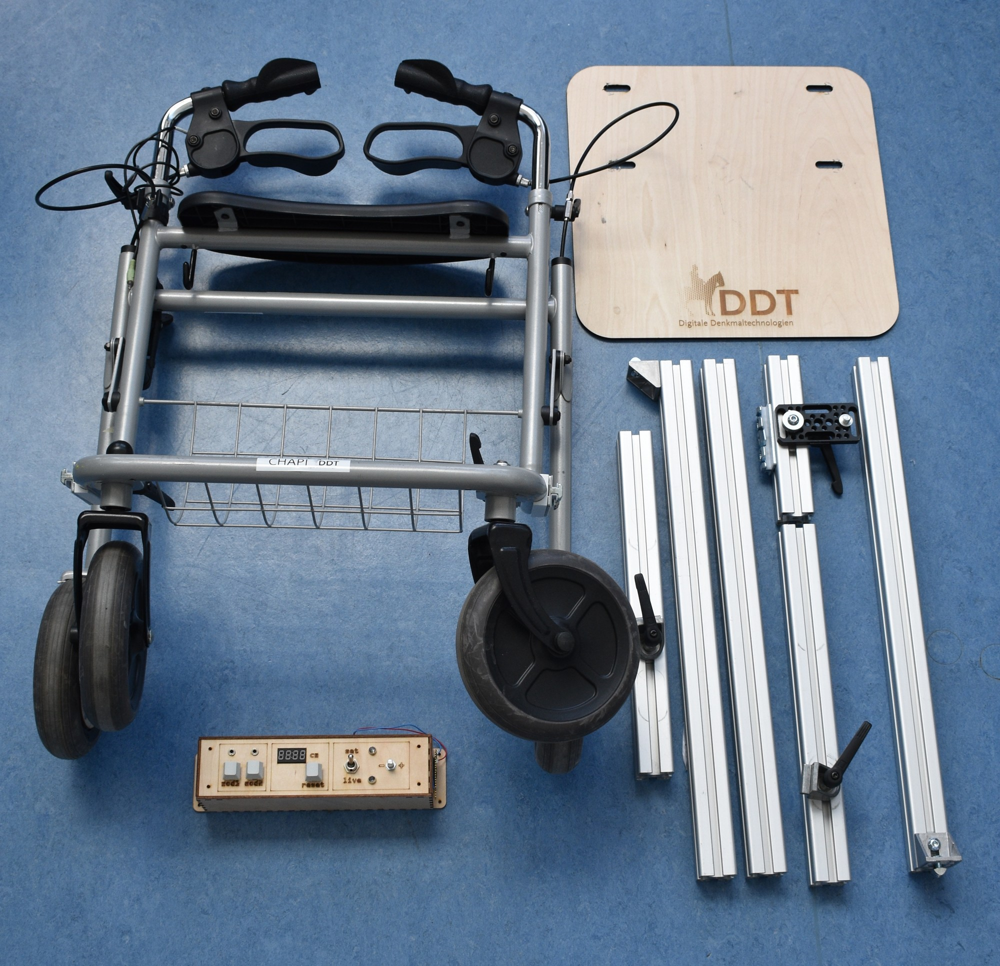

 
# CHAPI - Cultural Heritage Automated Photogrammetric Imaging

Meet CHAPI

# Goals

-  a stable, mobile platform on which a camera could be mounted in multiple orientations
-  a method of automatically measuring distance with a resolution sufficient for a dense photogrammetric network
-  a method of automatically triggering a camera tethered to a laptop
-  a low-cost solution that was also easy to assemble/disassemble for transport.

# Zenodo Content

What you see here is a condensed version, showcasing the final components used at the time of publication.
For more comprehensive details, including information about history, construction and experimental parts, please refer to the our complete set of data available on  [University of Bamberg Gitlab](https://gitlab.rz.uni-bamberg.de/ddt-public/chapi) or [Github](https://github.com/uniba-dthc/CHAPI).

# License

The project is licensed under MIT License to encourage the community to improve and adapt to their own needs and use cases. 

# ACKNOWLEDGEMENTS

CHAPI was created by Michael Groh for the [Department of Digital Technologies in Heritage Conservation](https://www.uni-bamberg.de/en/iadk/heritage-conservation-studies/digital-technologies-in-heritage-conservation/), part of the [Centre for Heritage Conservation Studies and Technologies (KDWT)](https://www.uni-bamberg.de/en/iadk/heritage-conservation-studies/centre-for-heritage-conservation-studies-and-technologies-kdwt/) at [University of Bamberg](https://www.uni-bamberg.de/en/) 
